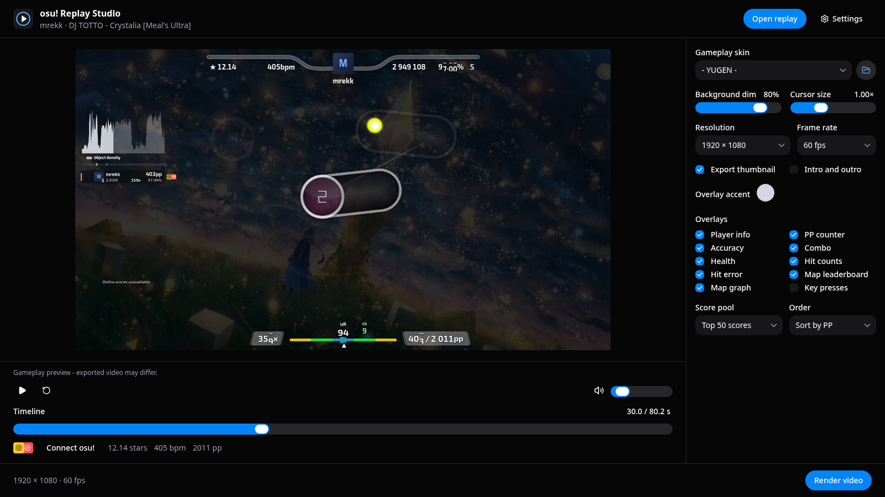

# osu! Replay Studio

Turn osu!standard stable and lazer replays into MP4 videos on Linux and Windows.
Preview gameplay with skins, music, and hit sounds. Add overlays, an intro, an outro, and a CPOLesque thumbnail.

## Install

Download the Linux AppImage or Windows installer from [Releases](https://github.com/agneswd/osu-replay-studio/releases/latest).
On Linux, allow the AppImage to run as a program, then open it.
The app includes Danser, FFmpeg, and the osu! PP calculator.
Release builds check GitHub for updates at launch. Choose whether to download, then restart when you are ready to install.
An OpenGL 3.3 graphics driver is required.

## Make a video

1. Select **Open replay** and choose an `.osr` file.
2. If the map is missing, choose its `.osz` archive. You can also set a stable **Songs folder** in Settings.
3. Use the timeline to preview the replay.
4. Set the skin, background dim, cursor size, and video options beside the preview.
5. Select **Render video**.

Use **Edit layout** to position and scale the playfield independently of the background.
You can also move, scale, and order each overlay. See the [layout guide](docs/layout.md) for examples.

Videos go to your Videos folder by default. Change the folder in **Settings**.
Open the **Thumbnail** tab to edit a CPOL or Clean thumbnail, then select **Export PNG**.
See [the thumbnail editor guide](docs/thumbnails.md) for editing, styles, and replay status.
The outro includes short entrance sounds. Preview volume affects only the app. Export audio uses a fixed loudness target.
Video defaults are 1920 × 1080 at 60 FPS. Existing files are kept. Space plays or pauses. Arrow keys seek five seconds. Ctrl+plus and Ctrl+minus change app scale. Ctrl+0 resets it.

Connect an osu! API client in **Settings** for player history, mapper portraits, and leaderboards.
Use **Create osu! client**, then enter the Client ID and Client Secret.
The app stores the secret through your system keyring.

## Prepare YouTube details

After importing a replay, select **YouTube details** beside **Render video**.
The app generates a title and description from the replay and map data. A completed video is not required.
Choose a **Play status** preset and enter a count for misses or slider breaks. Add optional YouTube and Twitch links.
Open **Player and map details** to correct profile links and account statistics.
The description groups player links, beatmap information, and player information. Edit either text field directly, then select **Copy**.
Blank optional fields are omitted. The counters check the title character limit and description UTF-8 byte limit.

Direct edits stay intact when you change the inputs or close the dialog.
Select **Regenerate** and confirm **Replace edits** to apply the current inputs again.
Opening another replay clears those edits and manual inputs. Only **Additional text** is saved for future replays and app restarts.
Render the video and export the finished PNG from the **Thumbnail** tab.
The dialog then shows **Ready to upload**, with both files under **Exported files**.
Use **Show file** to locate either export, or **Copy path** to paste its path into a file chooser.
The panel retains the latest completed exports for the current replay and session. Export again after changing the video or thumbnail.
Select **Open YouTube Studio** to open the official upload page in your normal browser.
Choose the MP4 and PNG there, then paste the copied text. The app does not upload files or fill browser fields automatically.

## Supported replays

- osu!standard stable replays with common mods, including DT, NC, HT, HD, and HR.
- Lazer supports NM, NF, EZ, TD, HD, HR, SD, PF, DT, NC, HT, DC, FL, CL, and DA.
- Custom speed and difficulty settings are supported within the app's checked ranges. Unsupported mod settings show an error.
- Other game modes, Relax, Autopilot, and ScoreV2 are not supported.
- Import a downloaded `.osz` archive or export the matching beatmap from lazer. Installing it in stable is optional.
- The preview uses replayviewer-js. Danser renders video. Their judgement simulation can differ.
- Live score and PP use replay simulation. Hit error and UR include circles only.
- PP uses the bundled official osu! calculator. New app builds include calculator updates.
- Online score summaries use the submitted score's current PP when available.
- Leaderboards show nearby entries from the map's top 50 or 100 scores, sorted by PP or score.
- Online statistics reflect the current data, not the replay date.

See [build instructions](docs/build.md), [CLI use](docs/cli.md), and [third-party software](THIRD-PARTY.md).
