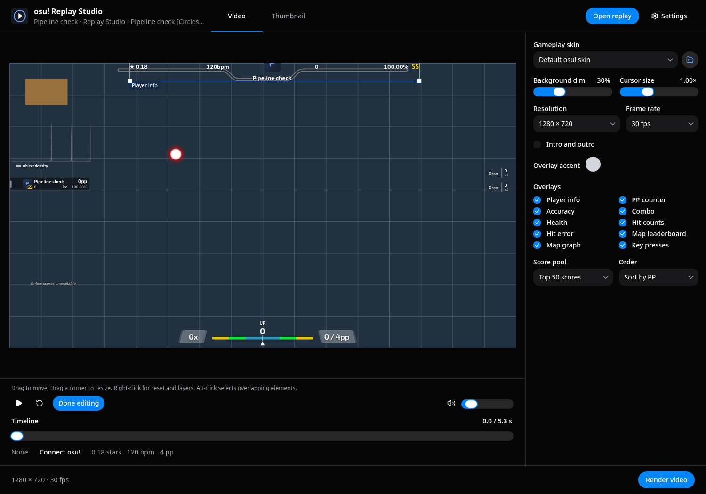
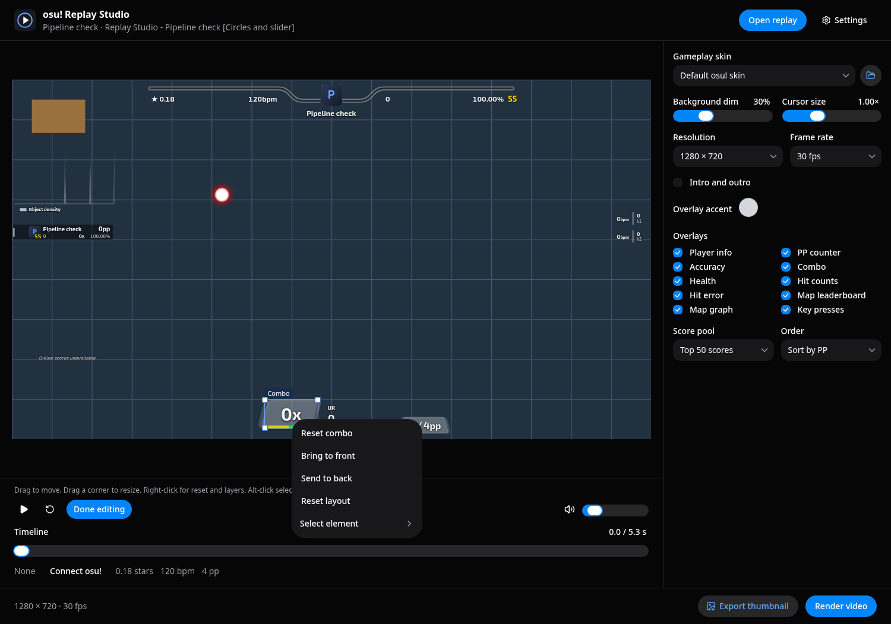
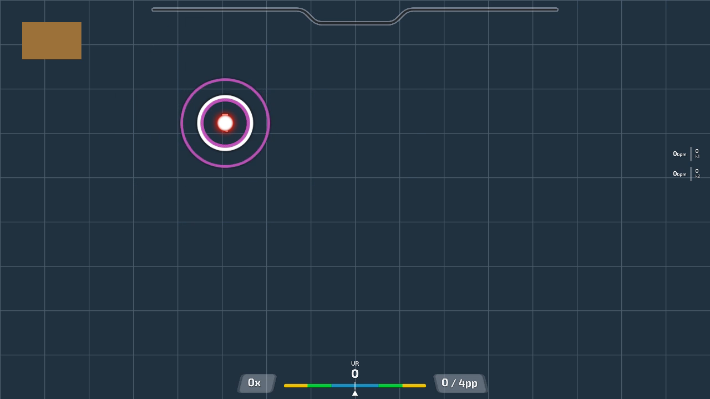
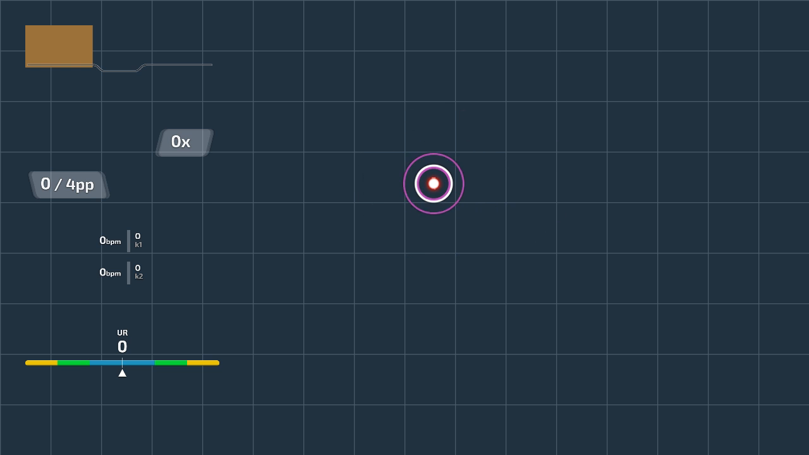

# Video layout

Choose **Edit layout** below the preview. Playback pauses so you can select and edit gameplay elements.
If an intro or outro is visible, the editor moves to gameplay.

Click an element and drag to move it. Drag a corner handle to resize it without changing its proportions.
The preview updates while you drag. The app saves the layout when you release the pointer.
Choose **Done editing** to return to normal preview controls.

**Player info** includes accuracy during editing. **Hit error** includes hit counts.
Moving, resizing, resetting, or changing the layer applies to both overlays in each group.
Their visibility checkboxes remain separate.

Right-click for **Reset element**, **Reset layout**, **Bring to front**, and **Send to back**.
The reset action uses the selected element's name. Resetting a layout does not change overlay visibility.
Use **Select element** in the same menu to reach an overlapping or off-canvas element.
Alt-click cycles through overlapping elements. Arrow keys move the selection by one design pixel; Shift uses ten pixels.
Escape cancels an active drag. Shift+F10 opens the selection menu from the keyboard.

The background fills the canvas independently of playfield position and scale.
Background videos and storyboards remain disabled. Overlays stay above gameplay and below score scenes.
Use the existing **Overlays** checkboxes to show or hide elements.

Layouts retain the 1920 x 1080 design canvas across preview and export resolutions.
Playfield scale supports 10% to 200%; overlay scale supports 25% to 300%.
Existing saved layouts continue to work.

## Example

These frames use the same synthetic replay, background, resolution, and time.
The grid and orange rectangle make background changes easy to detect.

The default layout centers the playfield and places overlays around it.

The custom layout sets the playfield center to X 1240, Y 560, at 60% scale.
The overlays occupy the left side. The background stays fixed.

The workspace preview and native export use the same layout settings.
Their gameplay simulation and base playfield size can differ because they use different renderers.
Older external Danser builds use browser overlay capture when a saved layout requires native layout support.

## JSON jobs

The optional `layout` field contains `playfield: { x, y, scale }` and an `overlays` object.
Include every overlay ID from the job's supported overlay list, even for hidden overlays.
Each overlay entry contains `{ x, y, scale, z }`. Scale uses a factor, so 60% is `0.6`.
Visibility still comes from the job's `overlays` array.
Omit `layout` to use the default layout. Invalid or incomplete job layouts produce an error.
