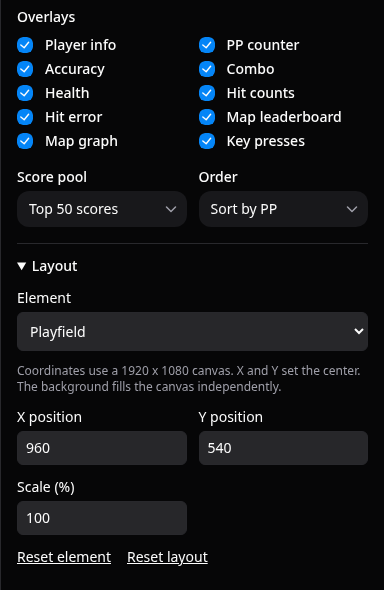

# Video layout

Open **Layout** below the overlay controls. Select the playfield or an overlay from **Element**.
Enter a value, then press Enter or leave the field to apply it.
The preview updates when you apply a value. The app saves the layout for later replays and exports.

All coordinates use a 1920 x 1080 design canvas. The app scales these coordinates to the selected video resolution.

For the playfield, **X position** and **Y position** set the center. **Scale** accepts 10% to 200%.
The background keeps its aspect ratio and fills the canvas. Playfield changes do not move or scale the background.
Background videos and storyboards remain disabled.

For an overlay, X and Y set the top-left corner of its container. Content can have internal alignment and padding.
Scale accepts 25% to 300%. **Layer** accepts 0 to 99. Higher layers appear in front of lower layers.
Elements on the same layer use their default draw order. Overlays stay above gameplay and below score scenes.
Use the existing **Overlays** checkboxes to show or hide each element.

**Reset element** restores only the selected element. **Reset layout** restores all positions, scales, and layers.
Neither reset changes overlay visibility.

## Example

These frames use the same synthetic replay, background, resolution, and time.
The grid and orange rectangle make background changes easy to detect.

The default layout centers the playfield and places overlays around it.

The custom layout sets the playfield center to X 1240, Y 560, at 60% scale.
The overlays occupy the left side. The background stays fixed.

The workspace preview and native export use the same layout settings.
Their gameplay simulation and base playfield size can differ because they use different renderers.
Older external Danser builds use browser overlay capture when a saved layout requires native layout support.

## JSON jobs

The optional `layout` field contains `playfield: { x, y, scale }` and an `overlays` object.
Include every overlay ID from the job's supported overlay list, even for hidden overlays.
Each overlay entry contains `{ x, y, scale, z }`. Scale uses a factor, so 60% is `0.6`.
Visibility still comes from the job's `overlays` array.
Omit `layout` to use the default layout. Invalid or incomplete job layouts produce an error.
