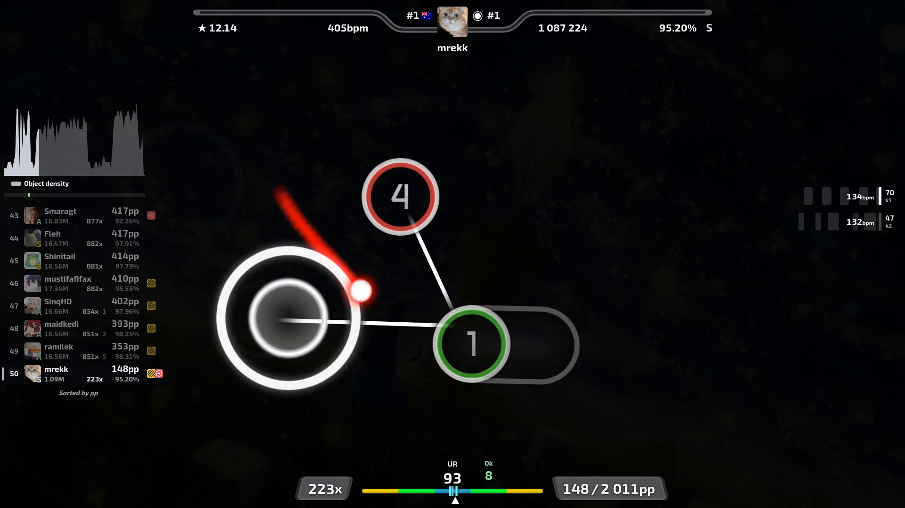
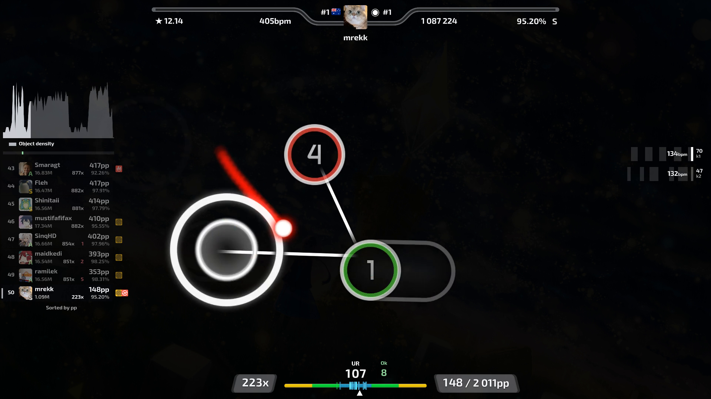

# Performance checks

Build the app and runtime first. Run these checks on the same machine and replay:

```sh
bun run benchmark
bunx tsx benchmarks/import.ts /path/to/job.json
bunx electron benchmarks/workspace.cjs /path/to/job.json
bunx tsx benchmarks/composite.ts
node benchmarks/capture.mjs
```

Use a local [render job](cli.md) with an explicit beatmap path for import and workspace checks.
The workspace check uses temporary settings. It measures playback and 100 random seeks, then repeats the seeks with cached graphics.
On Linux without a display, prefix Electron commands with `xvfb-run -a`.

Local Linux x64 results with Node.js 26.4 and Electron 44:

| Check | Before | After |
| --- | ---: | ---: |
| Repeat map lookup | 1,863 ms | 0.1-0.5 ms |
| Repeat replay analysis | 588 ms | 51-58 ms |
| Repeat preview asset loading | 81 ms | 13-19 ms |
| JavaScript time during five seconds of playback | 1.09 s | 0.25 s |
| App process memory | 1,429 MiB | 1,035 MiB |
| Software overlay capture at 720p | 45 frames/s | 54 frames/s |
| Linux AppImage | 367 MiB | 218 MiB |
| Unpacked Linux app | 779 MiB | 521 MiB |
| Windows installer | 372 MiB | 218 MiB |

The sampled replay has 574 score snapshots. These results are not hardware guarantees.
App memory sums process working sets and can count shared pages more than once.
Random seek drawing took 6.7 ms at the 95th percentile on the first pass and 0.2 ms on the second pass.
These drawing times exclude GPU completion and display latency.
The synthetic ten-minute overlay benchmark took 0.038 ms per frame, including JSON encoding.

Map matches are hash-checked before reuse. The PP cache holds up to eight results with at most 20,000 snapshots each.
The preview loads gameplay skin assets only. Unchanged video controls do not render on each playback frame.
Capture uses fast lossless PNG compression. Alpha tests check all 256 opacity values and cleared frames.
A shorter capture wait changed frame hashes, so the app retains the full paint wait.

Raw frame transfer took 2.18 s versus 2.78 s for PNG in a 120-frame test.
It changed decoded frame hashes and increased capture-process memory, so it was not retained.
Alternative RLE and Huffman compression also increased gameplay capture time.
Encoder cancellation now closes capture resources even when the input pipe is full.
The headless calculator excludes unused game resources and native graphics, audio, and video libraries.
Its published Linux runtime is 128 MiB. Calculator tests run against that reduced runtime.

The bundled renderer draws gameplay and HUD sprites on the GPU, then encodes video once with x264 fast at CRF 16.
Chromium prepares reusable artwork and glyphs before rendering. Frame commands use a compressed stream with bounded memory.
Plain gameplay skips HUD preparation. Audio processing copies the encoded video stream.
External Danser builds without native HUD support retain the browser path and exact video trimming.
That fallback captures only selected components and skips capture when overlays and scenes are disabled.
Hit-error ticks use a reusable canvas instead of rebuilding DOM elements for every frame.

Each export saves `<video>.render.log` and `<video>.render.json` beside the output.
The report includes settings, encoder settings, stage durations, captured frame count, and failure details.
These files remain after temporary files are removed, including after failed setup or cancellation.

A 30-second mrekk export at 1080p60 took 12.51 seconds with overlays and scenes disabled on a Ryzen 7 7800X3D.
It produced all 1800 video frames and captured zero overlay frames.
This is not directly comparable to an export with visible overlays.

## Native HUD

The native HUD keeps all ten components. It uses the existing timeline sampler and bundled fonts, flags, and mod artwork.
Text rasterization can differ from the browser preview. Gameplay no longer passes through an intermediate CRF-18 encode.
This change does not add hardware encoding or GPU-to-encoder transfer. FFmpeg still uses software x264 encoding.

Intro and outro scenes still use Chromium. Their held clear and blurred backgrounds are prepared once.
Chromium blends those images on the GPU. Opaque scene capture uses native PNG encoding.
The final file joins the scene videos and gameplay by stream copy. Audio stays on one continuous presentation clock.

Use the same job and a copy of the previous Danser runtime for a full export comparison:

```sh
node benchmarks/export.mjs /path/to/job.json /path/to/previous/danser-cli renders/evidence/export-comparison
```

The command runs three exports per renderer in alternating order. It saves each output, log, and timing report.
Use a new output directory for each run. Include all selected overlays and the same scene settings in both paths.

On 2026-09-07, a 30-second mrekk export at 1080p60 used all ten HUD components and no scenes.
Three alternating trials on a Ryzen 7 7800X3D with a Radeon RX 9070-series GPU gave these results:

| Renderer | Trial 1 | Trial 2 | Trial 3 | Median |
| --- | ---: | ---: | ---: | ---: |
| Browser | 59.81 s | 61.98 s | 62.93 s | 61.98 s |
| Native | 13.70 s | 13.97 s | 14.48 s | 13.97 s |

The native median used 77.5% less time, or 4.44 times the throughput.
These times include replay analysis, online data loading, HUD preparation, rendering, and audio processing.
They exclude application startup. Each output contained exactly 1800 frames and 30 seconds of audio.
Decoded audio matched between paths. A gameplay crop matched the same frame clock, with no one-frame shift.
The normal desktop session stayed active during these tests. Results on other hardware can differ.

A separate opaque scene PNG test averaged 7.17 ms with native encoding and 35.57 ms with JavaScript conversion and encoding.
Decoded pixels matched exactly in that test. This does not predict the same speed ratio for a full scene export.

A confirmation export after the timing-window and slider-head fixes took 14.18 seconds with the same 30-second job.
The first timing tick appeared at 0.668 seconds. DT windows were ±16 ms, ±43.33 ms, and ±71.33 ms.
Timing samples and color zones use playback milliseconds. Slider-head samples no longer wait for the slider tail.

### Rendered comparison

These frames show the same replay at 20 seconds, with all ten components enabled.
The native image includes the corrected timing windows and slider-head samples.
Text uses the same font, but browser and Canvas rasterization can produce different edges.

Browser composition:



Native composition:



### App response during scene capture

Scene capture runs in a separate Electron process. It prepares and compresses one requested frame at a time.
The main process forwards each complete PNG with backpressure. Cancellation closes the capture process and its temporary profile.

A 120-frame scene test at 1080p60 measured main-thread delays with a 1 ms sampling interval:

| Capture location | Export time | 99th-percentile delay | Maximum delay |
| --- | ---: | ---: | ---: |
| App process | 19.19 s | 154.66 ms | 161.35 ms |
| Separate process | 19.42 s | 1.14 ms | 27.26 ms |

These results measure event-loop response, not input-to-display latency. Shared CPU and GPU load can still affect the desktop.
Run `benchmarks/capture-responsiveness.cjs` with Electron, selecting `direct` or `isolated`, then a timeline JSON and background PNG.
