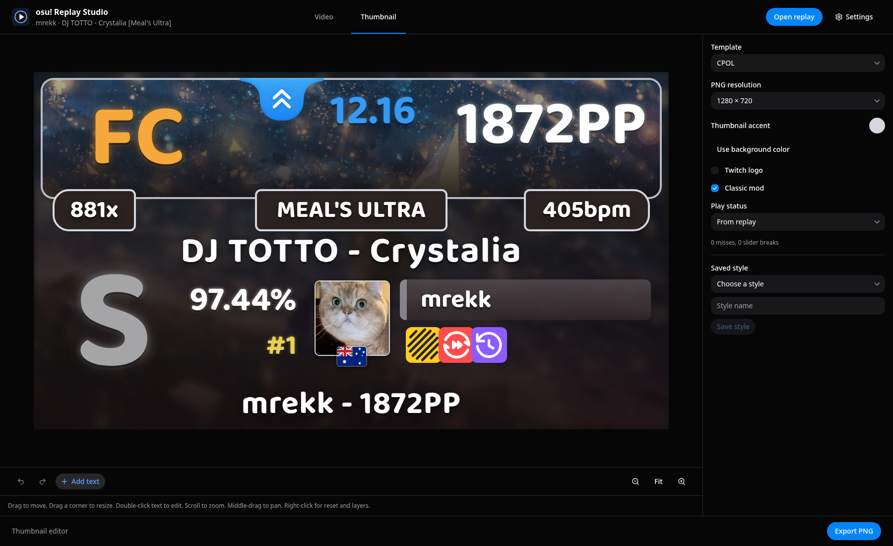

# Thumbnail editor

Choose **Thumbnail** in the top bar. Before import, the preview shows a gray frame and an **Open replay** button.
The sidebar and toolbar stay visible with replay controls disabled. The editor uses the replay's player, beatmap, score, mods, and background.
Choose the CPOL or Clean template. CPOL starts with an edge-to-edge top panel, a bottom border, and larger FC and miss labels.

Drag elements and resize them with corner handles, as in the video layout editor.
Double-click text to edit it directly in the preview. Changes appear as you type. Press Enter to accept or Escape to cancel.
Use arrow keys to move one design pixel. Hold Shift for ten pixels.
Right-click for reset, visibility, and layer order. Alt-click cycles through overlapping elements.
The context menu can select hidden or off-canvas elements.

The editing controls sit below the preview. Use **Add text** for a custom caption. **Duplicate** copies the selected element, including its text or image, appearance, and size. Each copy can be edited separately. Ctrl+D does the same.
Change color, font, weight, and font size in the selected-element controls. Enable **Text glow** on replay text and custom text. Enable **Gradient fill** for rank letters and other captions.
Combo, difficulty, and BPM badges can use a bottom-only border, plus radius and thickness. **Background shading** controls darkness in the lower background. **Drop shadow** adds a shadow to panels, images, badges, and text. Set its color, blur, and offset globally or per element.
For bottom text, select words in the text field and choose **Accent selection**.
Undo and redo keep one drag or resize as one action. Ctrl+Z undoes; Ctrl+Shift+Z redoes.
Scroll the mouse wheel to zoom. Drag with the middle mouse button to pan. **Fit** restores the canvas view.

The accent color is shared with the Video tab. Changing either color control updates both tabs and exports.
The Classic mod visibility control appears only for stable replays or lazer replays with Classic enabled.

Edits save locally for each replay path. Switching tabs keeps both editors' state.
Saved styles keep appearance and placement, but omit replay text and status overrides.
Applying a style replaces the current thumbnail edits. Undo restores them.

Choose a PNG resolution from 720p through 4K, then select **Export PNG** at the bottom right.
The preview and export use the same thumbnail component and document.
Export saves to the configured output folder. Fonts and flag artwork are bundled locally.

## Replay status

The analyzer separates slider breaks from ordinary misses and dropped slider tails.
For stable plays, a completely missed slider counts as a miss rather than an additional slider break.
Failed heads, ticks, and repeats on partially hit sliders count as slider breaks.

Automatic FC requires a complete play, no misses, and no slider breaks.
Stable and Classic plays also require matching reconstructed hit counts.
Non-Classic lazer plays use recorded judgement and slider statistics, even when simulation differs.
The exact online score can supply missing status evidence. Conflicting recorded and online status remains unverified.
Dropped tails can reduce maximum combo without preventing this community definition of FC.
The analyzer also retains whether the play achieved the map's maximum combo.
Incomplete plays and missing status evidence do not automatically receive FC.
Use the status controls to override the thumbnail label without changing the replay analysis.

The editor and template code are adapted from [osu! Thumbnailer](https://github.com/purnac501/osu-thumbnailer).
The port uses Replay Studio's desktop export and replay analysis instead of Thumbnailer's web API and image export service.
